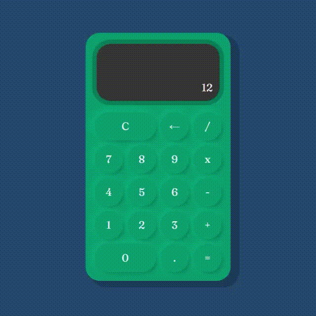

# 

#  Calculadora Retrô

O projeto consiste em uma calculadora simples com estilo retrô.

------

### :rocket: Link de acesso:

<a href="https://thalesnunes.com.br/pequenos-projetos/calculadora/" target="_blank">Clique aqui...</a>

------

### :rocket: Funcionalidades:

  
- Reliza contas de somar, subtrair, multiplicar e dividir.
- Aceita números decimais.
- Display mostra a conta a ser realizada.
- Botão de apagar para corrigir número ou operador digitado.
- Botão de limpar o display.

------

### :rocket: Recursos utilizados:

- Para o funcionamento da calculadora foi criada uma classe contendo métodos com as operações.
- Para o display foi criada uma classe com todos os métodos necessários, inclusive o método construtor que instancia uma nova calculadora bem como as variáveis necessárias.

------

### :rocket: Preview:

 </img>

------

###  :rocket: Contato:

Alguma dúvida, crítica ou elogio? Não hesite em entrar em contato. Será um prazer conversar a respeito!

 [Whatsapp](https://api.whatsapp.com/send?phone=5535997438652) |  [E-mail](mailto:thales.o.nunes@gmail.com)