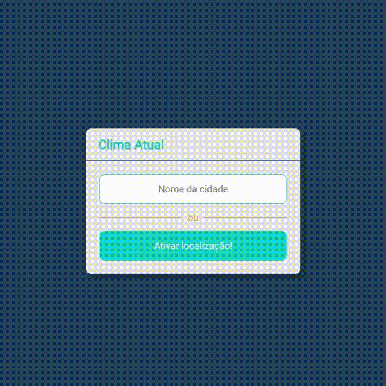

# 

#  Clima Atual

O projeto consiste em gerar informações acerca do clima atual de determinada cidade.

------

### :rocket: Link de acesso:

<a href="https://thalesnunes.com.br/pequenos-projetos/clima-atual/" target="_blank">Clique aqui...</a>

------

### :rocket: Funcionalidades:

    
- Consultar o clima atual de uma cidade digitando o nome da mesma.
- Consultar  o clima atual por geolocalização.

------

### :rocket: Recursos utilizados:

- É consumido uma API que gera as informações necessárias. [OpenWeather](https://openweathermap.org/)
- Utilizando-se das informações recebidas pela Api, altera-se, além das informações do clima, o ícone correspondente.
- Classes CSS para ocultar ou revelar determinados elementos de HTML.
- Design responsivo.
- Entre outros...

------

### :rocket: Preview:

 </img>

------

###  :rocket: Contato:

Alguma dúvida, crítica ou elogio? Não hesite em entrar em contato. Será um prazer conversar a respeito!

 [Whatsapp](https://api.whatsapp.com/send?phone=5535997438652) |  [E-mail](mailto:thales.o.nunes@gmail.com)