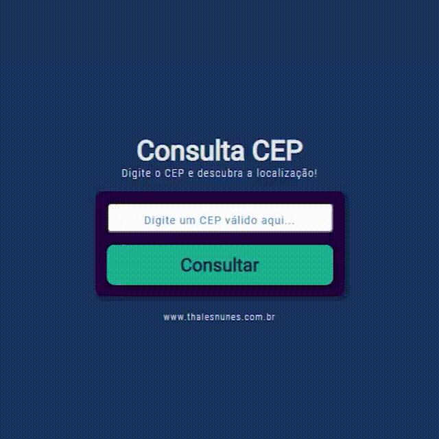

# 

#  Consulta CEP

O projeto consiste em gerar o endereço referente ao CEP digitado.

------

### :rocket: Link de acesso:

<a href="https://thalesnunes.com.br/pequenos-projetos/consulta-cep/" target="_blank">Clique aqui...</a>

------

### :rocket: Funcionalidades:

    

- Consultar endereço digitando um CEP.

------

### :rocket: Recursos utilizados:

- Foi utilizado Promises JavaScript pra consumir uma API
- É consumido a [API Via Cep](https://viacep.com.br/) que gera o dados necessários.
- São tratados todos os tipos de erros possíveis.

------

### :rocket: Preview:

 </img>

------

###  :rocket: Contato:

Alguma dúvida, crítica ou elogio? Não hesite em entrar em contato. Será um prazer conversar a respeito!

 [Whatsapp](https://api.whatsapp.com/send?phone=5535997438652) |  [E-mail](mailto:thales.o.nunes@gmail.com)