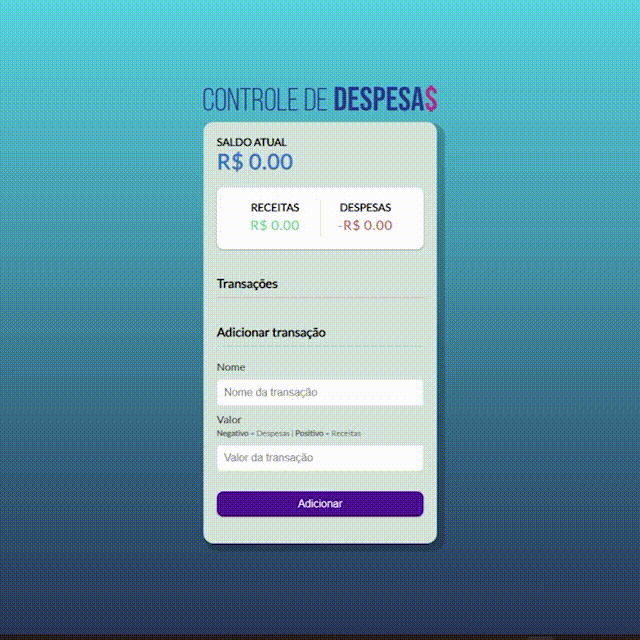

# 

#  Controle de Despesas

O projeto em uma aplicação para controle de despesas

------

### :rocket: Link de acesso:

<a href="https://thalesnunes.com.br/pequenos-projetos/controle-de-despesas/" target="_blank">Clique aqui...</a>

------

### :rocket: Funcionalidades:

    

- Adicionar receitas ou despesas.
- Remover transações.
- Gerar saldo atual
- Gerar total de entradas
- Gerar total de saidas

------

### :rocket: Recursos utilizados:

- É inserido novos elementos (transações) no DOM.
- Foi utilizado localStorage para armazenar os dados das transações para que o usuário não perca as informações caso reinicie a aba da aplicação.
- Entre outros...

------

### :rocket: Preview:

 </img>

------

###  :rocket: Contato:

Alguma dúvida, crítica ou elogio? Não hesite em entrar em contato. Será um prazer conversar a respeito!

 [Whatsapp](https://api.whatsapp.com/send?phone=5535997438652) |  [E-mail](mailto:thales.o.nunes@gmail.com)