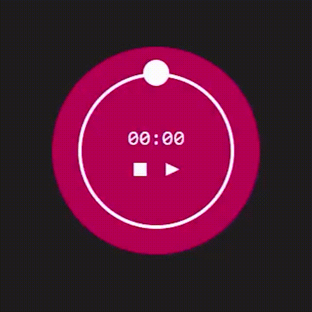

# 

#  Cronômetro circular

O projeto consiste um cronômetro circular com ponteiro que percorre sua borda.

------

### :rocket: Link de acesso:

<a href="https://thalesnunes.com.br/pequenos-projetos/cronometro/" target="_blank">Clique aqui...</a>

------

### :rocket: Funcionalidades:

  
- Cronometra.
- Tem opção de pausar e parar.
- Possui um ponteiro circular que percorre a borda do cronometro.

------

### :rocket: Recursos utilizados:

- Para cumprmir com as necessidades do projeto, em JS foi preciso lidar com Date, setInterval e Math.
- Já no CSS, foi preciso lidar com animation e @keyframes para realizar a rotação do ponteiro.
- Entre outros...
  
------

### :rocket: Preview:

 </img>

------

###  :rocket: Contato:

Alguma dúvida, crítica ou elogio? Não hesite em entrar em contato. Será um prazer conversar a respeito!

 [Whatsapp](https://api.whatsapp.com/send?phone=5535997438652) |  [E-mail](mailto:thales.o.nunes@gmail.com)