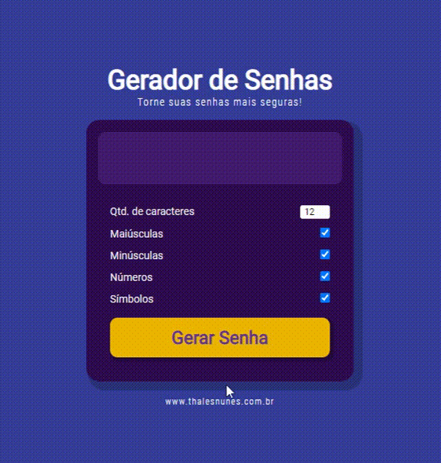

# 

#  Gerador de Senhas

O projeto consiste em gerar senhas seguras.

------

### :rocket: Link de acesso:

<a href="https://thalesnunes.com.br/pequenos-projetos/gerador-de-senhas/" target="_blank">Clique aqui...</a>

------

### :rocket: Funcionalidades:

  
- Selecionar a quantidade desejada de caracteres da senha.
- Se deve ou não incluir letras maiúsculas.
- Se deve ou não incluir letras minúsculas.
- Se deve ou não incluir números.
- Se deve ou não incluir caracteres especiais.
- Gerar nova senha.
- Botão de copiar a senha.

------

### :rocket: Recursos utilizados:

- Variáveis para cada grupo de caracteres.
- For / Math.floor / Math.random para gerar senhas aleatórias.
- Diversas functions.
- Animation / @keyframes no CSS para transição de cor no background.
- Entre outros...

------

### :rocket: Preview:

 </img>

------

###  :rocket: Contato:

Alguma dúvida, crítica ou elogio? Não hesite em entrar em contato. Será um prazer conversar a respeito!

 [Whatsapp](https://api.whatsapp.com/send?phone=5535997438652) |  [E-mail](mailto:thales.o.nunes@gmail.com)