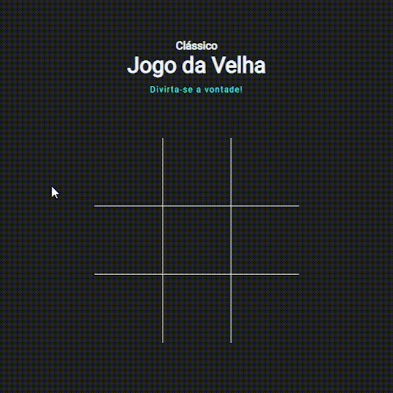

# 

#  Jogo da Velha

O projeto consiste no clássico Jogo da Velha, mas em uma versão com visual moderno.

------

### :rocket: Link de acesso:

<a href="https://thalesnunes.com.br/pequenos-projetos/jogo-da-velha/" target="_blank">Clique aqui...</a>

------

### :rocket: Funcionalidades:

  
- Alternância aumtomática de jogador, "X" ou "O".
- Notificação do jogador vencedor.
- Botão de reiniciar o jogo.

------

### :rocket: Recursos utilizados:

- QuerySelector para referenciar os elementos. 
- Programação funcional que se utiliza principalmente das classes aplicadas ao HTML e eventListener para estabelecer a lógica e funcionamento do jogo.
- Desestruturação de Array.
- Entre outros...

------

### :rocket: Preview:

 </img>

------

###  :rocket: Contato:

Alguma dúvida, crítica ou elogio? Não hesite em entrar em contato. Será um prazer conversar a respeito!

 [Whatsapp](https://api.whatsapp.com/send?phone=5535997438652) |  [E-mail](mailto:thales.o.nunes@gmail.com)