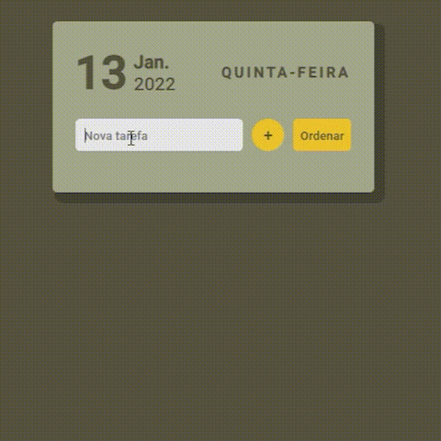

# 

#  Lista de Tarefas

O projeto consiste em uma lista de tarefas simples.

------

### :rocket: Link de acesso:

<a href="https://thalesnunes.com.br/pequenos-projetos/lista-de-tarefas/" target="_blank">Clique aqui...</a>

------

### :rocket: Funcionalidades:

  
- Mostra a data do dia no cabeçalho.
- Possui a opção de adicionar novas tarefas.
- Ao clicar na terefa a mesma é marcada como feita.
- Clicando em uma tarefa cumprida ela volta ao estado de "a fazer".
- Possui um botão de ordenar as tarefas, que coloca as tarefas feitas no fim da lista.

------

### :rocket: Recursos utilizados:

- Foi utilizado Date para armazenar a data do dia.
- O document.createElement para criar novas tarefas.
- O forEach para ordenar as tarefas.
- E addEventListener para mudar o estado da tarefa.
- Entre outros...

------

### :rocket: Preview:

 </img>

------

###  :rocket: Contato:

Alguma dúvida, crítica ou elogio? Não hesite em entrar em contato. Será um prazer conversar a respeito!

 [Whatsapp](https://api.whatsapp.com/send?phone=5535997438652) |  [E-mail](mailto:thales.o.nunes@gmail.com)