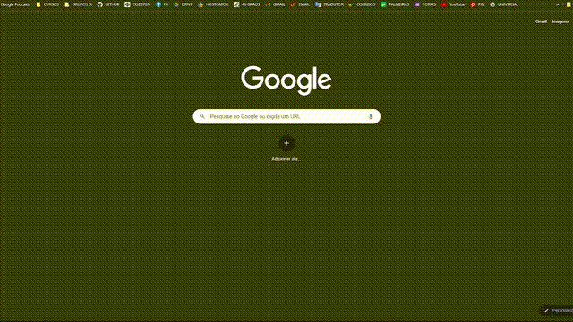

# 

#  Site da marca Sabor Caipira

O projeto consiste em um web site feito para uma marca de produtos alimentícios e artesanais mineiros.

------

### :rocket: Link de acesso:

<a href="https://thalesnunes.com.br/pequenos-projetos/sabor-caipira/" target="_blank">Clique aqui...</a>

------

### :rocket: Funcionalidades:

    

- Apresentação da marca seguindo uma identidade visual coerente.
- Exposição das categorias dos produtos da marca.
- Catálogo de produtos.
- Formulário para encomendas.
- Slide de imagens com diversas imagens dos produtos.
- Slide de frases que reforçam o "mood" da marca.
- Formulário de contato.
- Link para localização.
- Links para redes sociais.
- Informações de endereço.

------

### :rocket: Recursos utilizados:

- Foi feita um arquivo CSS com com grids pré-determinados, o que facilita bastante a diagramação, principalmente no que diz respeito a disposição de elementos e o tratamento da responsividade. O intuito foi conhecer a técnica que se assemelha em alguns aspectos o que alguns frameworks como Bootstrap oferecem. 
- Para algumas animações foi utilizado um plugin existente fornecidos pela Origamid. Embora, pudesse facilmente serem feitas manualmente, o intuito foi trabalhar com códigos de terceiros, o que aumenta consideravelmente o desafio de desenvolvimento e se aproxima de cenários reais. 
- Para o funcionamento do formulário, foi utilizado PHPMailer.
- Design responsivo.
- Entre outros...

------

### :rocket: Preview:

 </img>

------

###  :rocket: Contato:

Alguma dúvida, crítica ou elogio? Não hesite em entrar em contato. Será um prazer conversar a respeito!

 [Whatsapp](https://api.whatsapp.com/send?phone=5535997438652) |  [E-mail](mailto:thales.o.nunes@gmail.com)